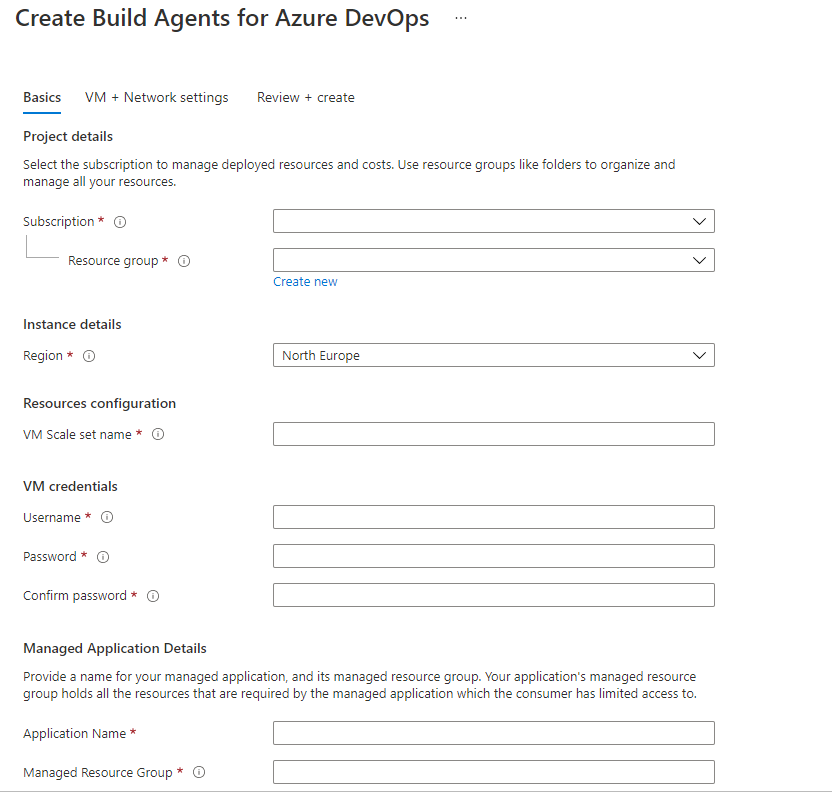
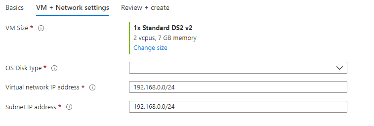
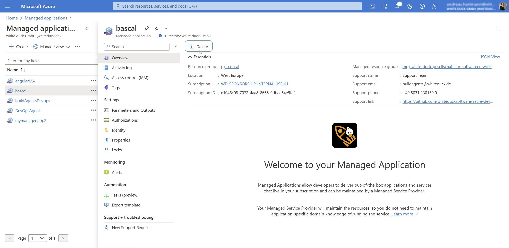

# Deployment: Build Agent SCALABLE

This documentation describes the fields for deploying the Build Agent SCALABLE in Azure.

## Basics

* **Subscription:** select the Azure subscription you want to deploy in
* **Resource group:** select/create the resource group you want to deploy to
### Instance details
* **Region:** choose the region for the deployment
### Resources configuration
* **VM Scale set Name:** create a name for the VM Scale set
### VM credentials
* **Username:** create a username for the admin user
* **Password/Confirm password:** set a valid password for the admin user
### Managed Application Details
* **Application Name:** set a name for the managed application. The managed application will appear in the resource group you chose above and contain the managed resource group.
* **Managed Resource Group:** set a name for the managed resource group. This resource group will contain all the actual resources that will be deployed. E.g. VM Scale set, vNet..

## VM + Network settings

* **VM Size:** select the size of your VM instances
* **OS Disk Type:** choose a disk type, e.g. "Standard SSD"
* **Virtual network IP address:** set the desired IP address for the vNet. Default is 192.168.0.0/24
* **Subnet IP address:** set the desired IP address for the subnet. Default is 192.168.0.0/24

## Review + Create

* Review the deployment settings and agree to the terms and condition for Co-Admin Access. Click on **Create**
* The Build Agent – Linux VM Scale Set is now ready to be used in your Azure DevOps Piplines.
* Configure the Scale Set VM according to your needs.

## Cancel Build Agent Scalable Subscription

To cancel the Build Agent Scalable monthly subscription navigate to Managed Services in your Azure portal and simply click the delete button and confirm the deletion:

