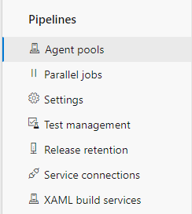
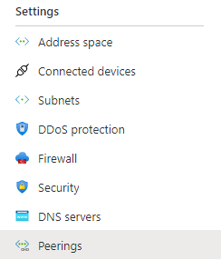
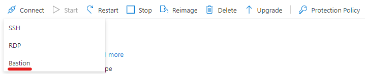

# Build Agent SCALABLE

## Connect to Azure DevOps agent pool

After deployment, it is required to connect the newly created scale set with Azure DevOps. Azure DevOps will take care of installing the agents and scaling the VM's in and out.

## Create a scale set agent pool

- Open the *Organisation Settings* or *Project Settings* in Azure DevOps
- Navigate to **Agent pools** under the **Pipelines** section and click **Add pool**

- in the *Pool type* dropdown field select **Azure virtual machine scale set**
- Select the correct Azure Subscription and scale set name
- Input a name for the new agent pool
- Set the pool options based on your needs and preferences
- Click **Create**

After creation, Azure DevOps will start provisioning build VM's according to the specified pool settings

Helpful links: [Create a scale set agent pool](https://docs.microsoft.com/en-us/azure/devops/pipelines/agents/scale-set-agents?view=azure-devops#create-the-scale-set-agent-pool)

## Connect to a VM for troubleshooting purpose (with Azure Bastion)

By default all VM's inside the scale set are not provisioned with a public IP, thus can not be reached from outside e.g. trough SSH.
In case there is the need to connect to a VM you can use vNet peering and Azure Bastion. There are a couple important steps when creating the vNet.

### 1. Deploy the vNet

- Start the creation of a vNet inside a new resource group
- In the "Security" step, enable **BastionHost**
- Input a valid address space for the *AzureBastionSubnet* field according to the vNet address space - e.g. 192.168.1.0/24
- Select "Create new" under the *Public IP address* field and give it a name
- Create the vNet

### 2. Set up vNet peering

- Select the newly created vNet
- In the **Peerings** blade under *Settings*, click **Add**

- Input a Peering link name for this virtual network and for the remote virtual network
- Select the correct Subscription and virtual network (vNet of the scale set)
- Click **Add** to create the peering

### 3. Connect to the VM

- Select the VM instance to connect to
- Click **Connect** and select the option **Bastion**

- Click **Use Bastion** and input the login credentials for the VM
- Click **Connect**
