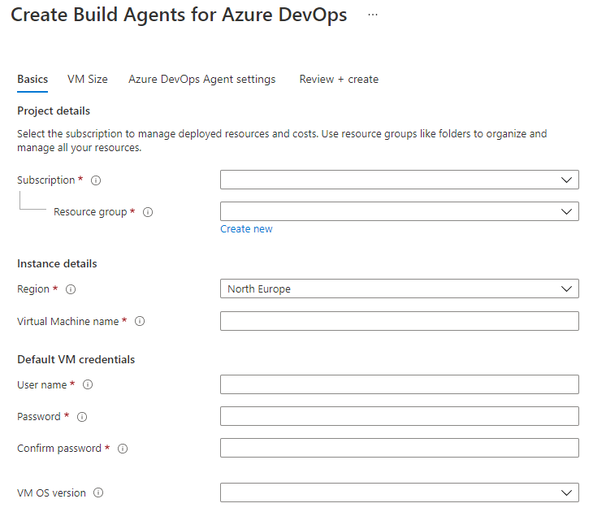
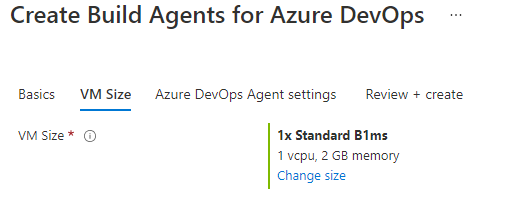
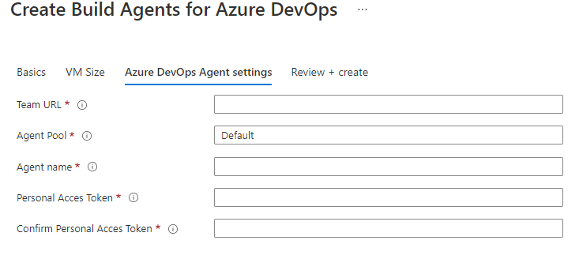

# Deployment: Build Agent SCALABLE

This documentation describes the fields for deploying the Build Agent SINGLE WINDOWS VM in Azure.

## Basics

* **Subscription:** select the Azure subscription you want to deploy in
* **Resource group:** select/create the resource group you want to deploy to
### Instance details
* **Region:** choose the region for the deployment
* **Virtual Machine name:** choose a unique name for your virtual machine
### Default VM credentials
* **User Name:** create a username for the admin user
* **Password:** set a valid password for the admin user
* **Confirm password:** set a valid password for the admin user
* **VM OS version:** Choose a OS version

## VM Size

* **VM Size:** select the size of your VM instances

## Azure DevOps Agent settings

* **Team URL:** input your Azure DevOps Url, e.g. `https://dev.azure.com/YOURTEAM`
* **Agent Pool:** specify the agent pool where your agent should be registered
* **Agent Name:** Specify a name for your private build agent. Agent names should be unique within a agent pool
* **Personal Access Token:** Enter the Personal Acces Token used for configuring the agent.

## Review + create

* Review the deployment settings and  Click on **Create**